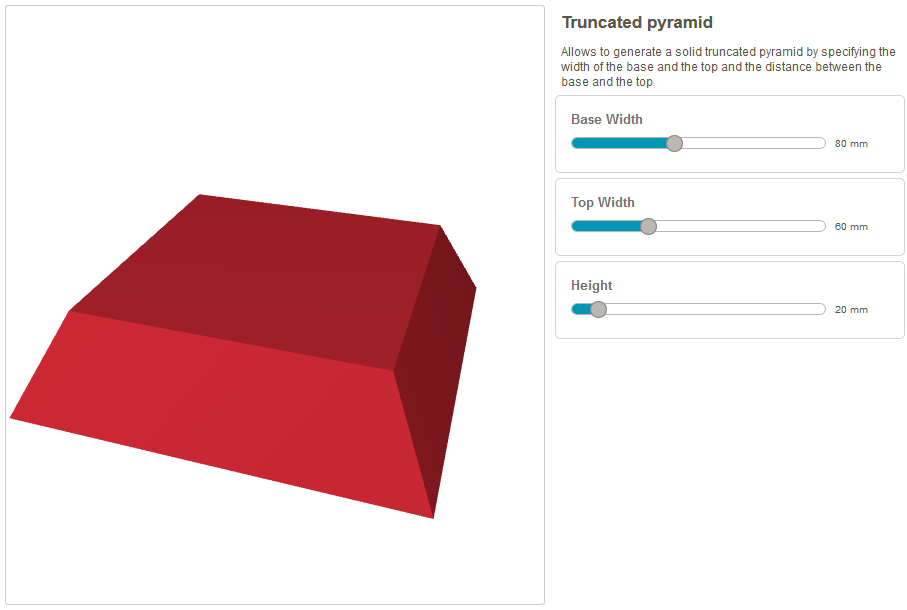

# Custom shape generators for Tinkercad

This repository contains shape generators I created for [Tinkercad](https://www.tinkercad.com).

## Truncated Pyramid

The `truncated-pyramid.js` allows you to generate a solid truncated pyramid by specifying the width of the base and the top,
and the distance between the base and the top (height).

This is how it looks like with the default settings:

This shape generator is available in Tinkercad among the [Community Shape Generators](https://api.tinkercad.com/libraries/tour/generators), 
or you can get it directly in this URL: [https://api.tinkercad.com/libraries/gYO23fKQzgi/0/docs/index.html](https://api.tinkercad.com/libraries/gYO23fKQzgi/0/docs/index.html).

